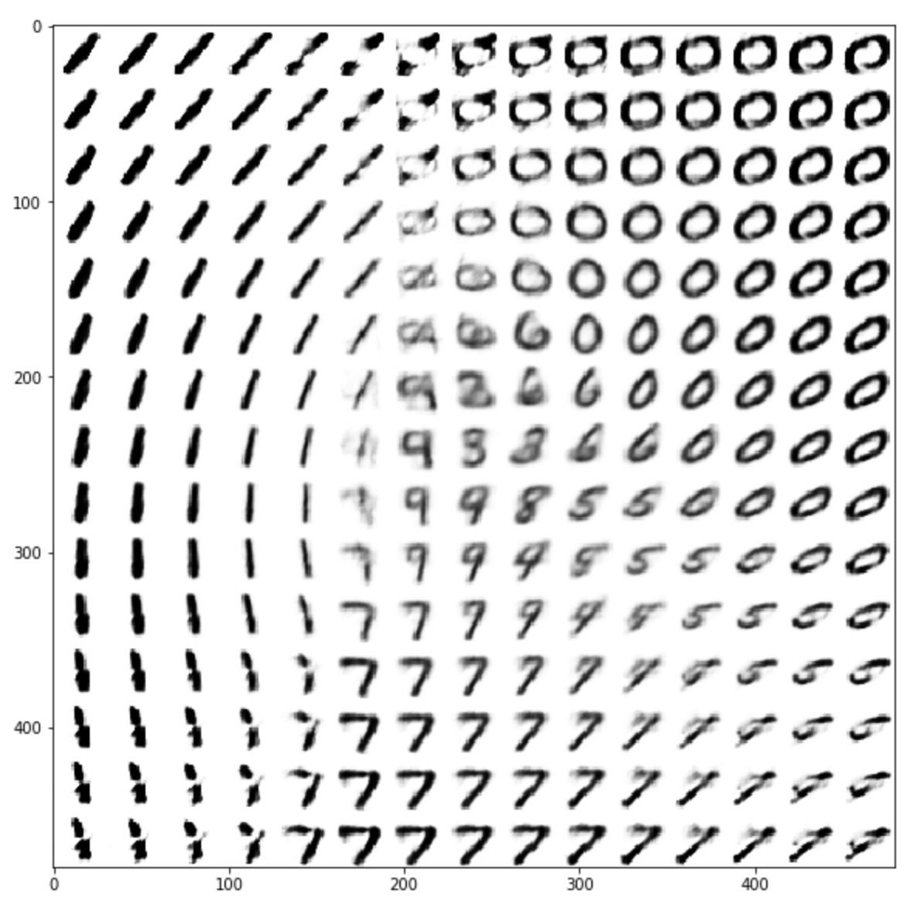
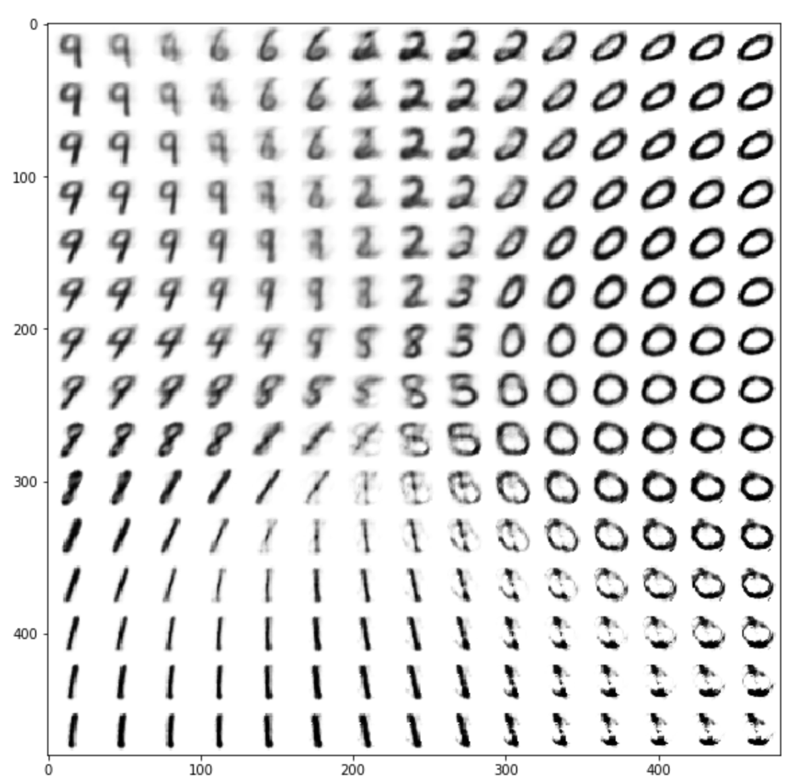
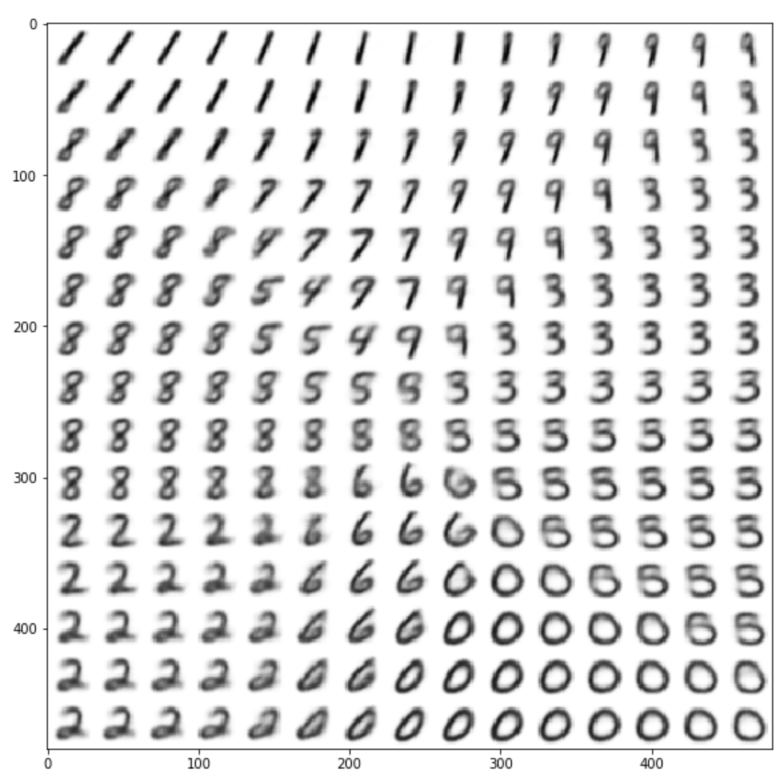
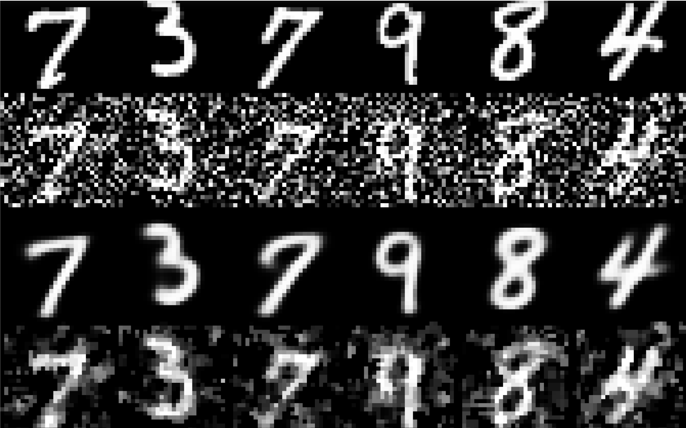
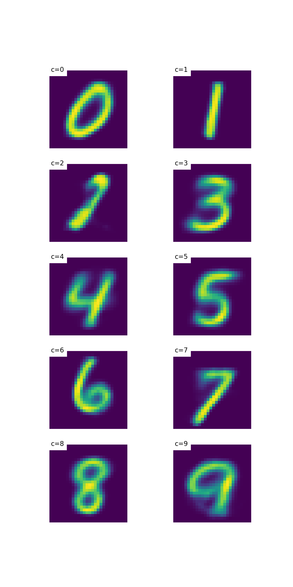
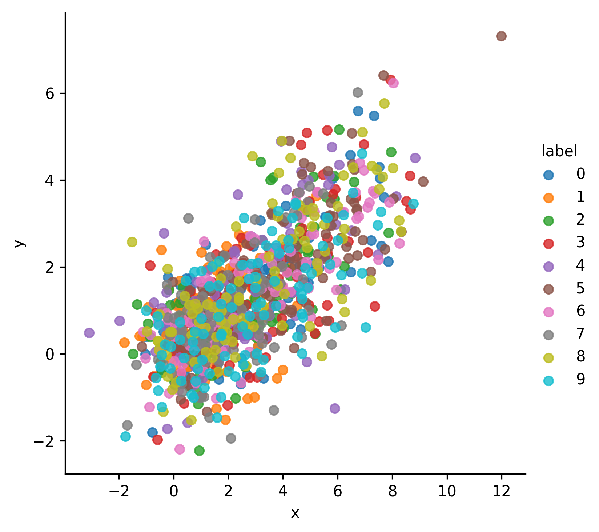
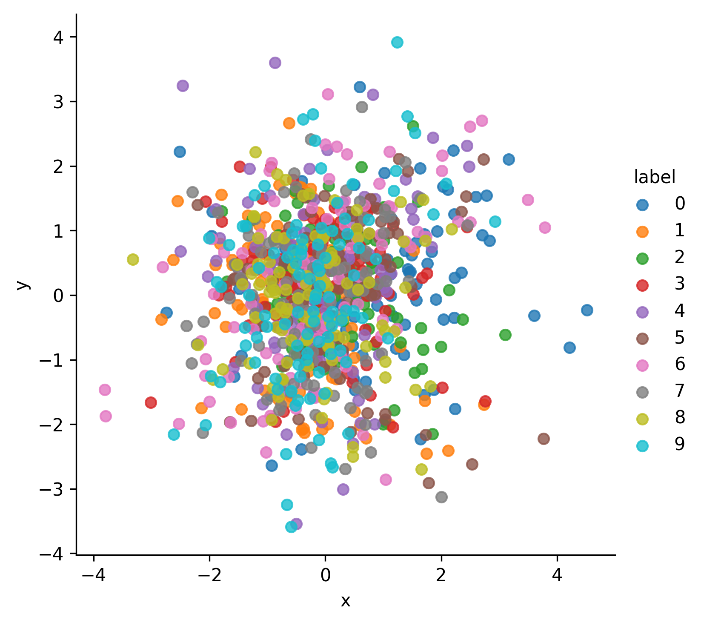
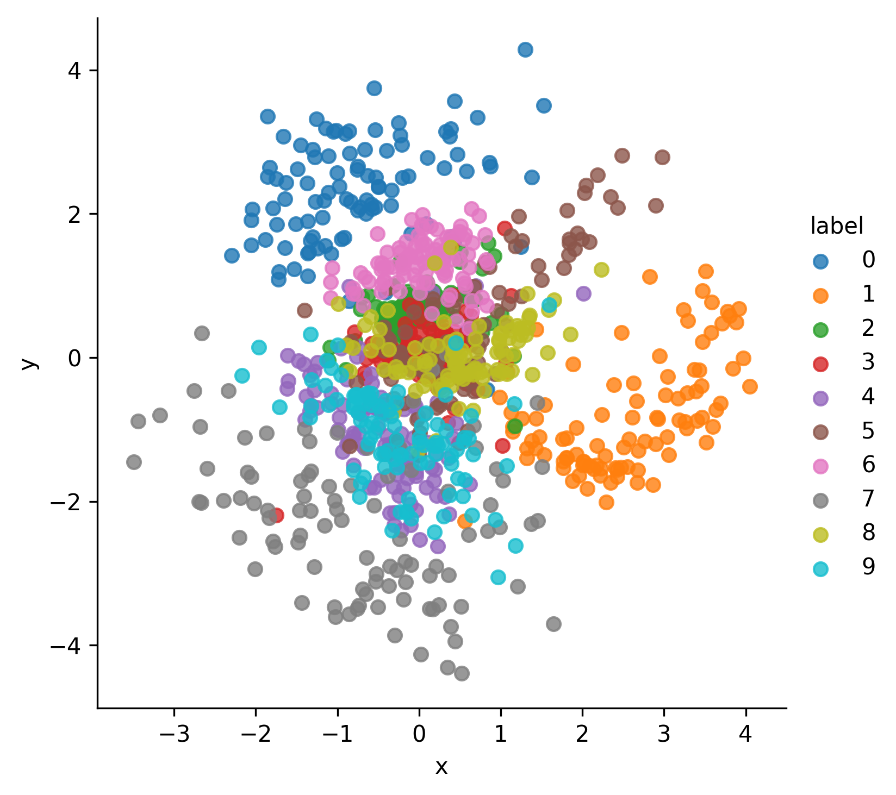
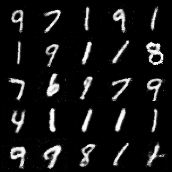

# Reconstruction
Currently I mainly worked on VAE generator. I have tried two kinds of VAE architecture using Conv form and linear form shown as follow:

I've tried two kinds of loss funciton as said in the project, also I have tried VAE on two datasets, namely mnist & Stanford Dog.

Work on mnist 

- Simple VAE with different loss function. I trained a Linear model with MSE loss & BCE loss alternatively. Then another Conv model using BCE  loss is trained to compare with. We can see its distinct understanding of the mnist digits.
  
  Linear Model with BCE Loss
  
  Linear Model with MSE Loss
  
  Conv Model with BCE Loss
- As we can imagine, VAE gives a noise to the z dimension, so it can merge two style together by getting mean of two z's.
  
  We get an eight & a seven to it and we can get a strange digit which not assemble to 7 or 8.
- Different types of VAEs have different power. Denoising VAE train the network with given image adding some Gaussian noise. 
  
  The first row is original image where second row is noised. Third row is our Denoising-VAE result & the last row is referred to Mediate Filter.
- Conditional-VAE aims to add the class category to the dimension. Then we can generate given class of the different digits shown as follow. We can not only randomly sample from dataset, but randomly assign a noise and get a digits on it.
  
- What's more, we want to see how the z dimension spell these digits and know these digits. Thus we set z dimensions as 2 and do visualization of the z dimension shown as follow.
  
  This is the condition that before training.
  
  CVAE after training
  
  normal VAE after training
- We also tried GAN on mnist shown as follow.
  
- For RGB images, we also do VAE on Stanford Dog dataset.

