# Little-Conv-Classification

一个四层的小卷积网络，训练狗数据集，得到的结果如下

可以看到，**根本来不及学到东西**

如果我们增大网络，则会让它更容易过拟合，然而，TestPrec又一直上不去，所以我们应该怎么办呢？

## 逐个epoch的grad cam 分析

#### 完全过拟合的epoch（epoch115）

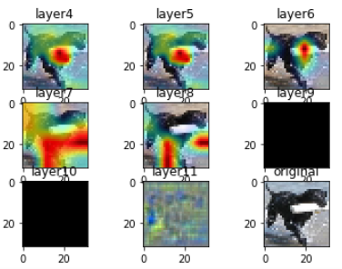

这个图片比较特别，相较数据集中大部分的背景是室内或者草地，图片有水花，狗还叼着东西，可以看到网络注意在水花还有叼着一根棒子上。

可以看到这张图里面神经网络关注的仅仅是左上角和右下角

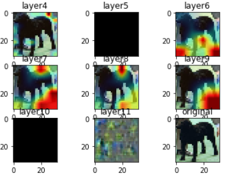

关注着这个狗两腿分立的姿势

#### Epoch 1

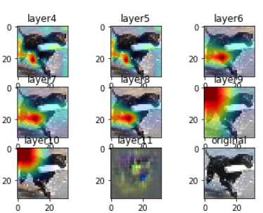

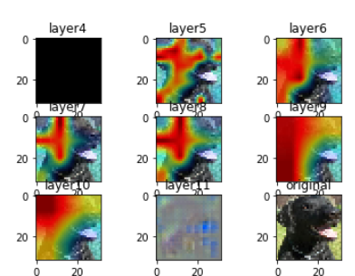

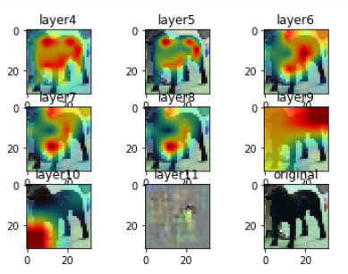

#### Epoch3

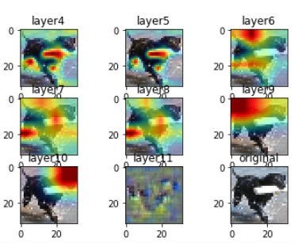

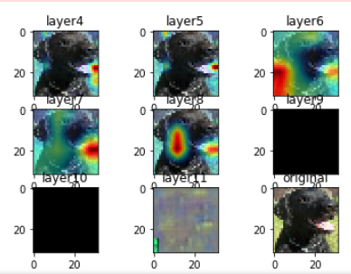

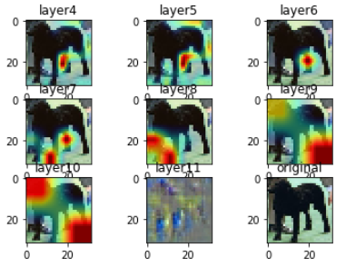

#### Epoch 5

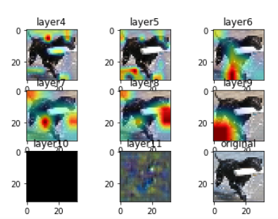

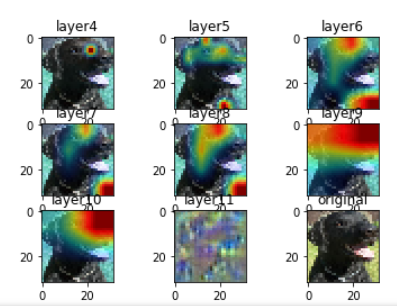

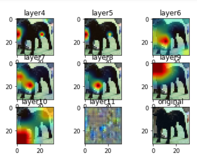

#### Epoch7

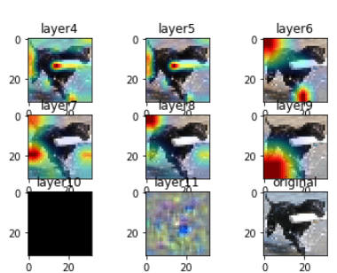

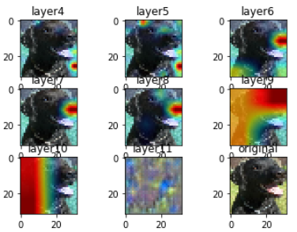

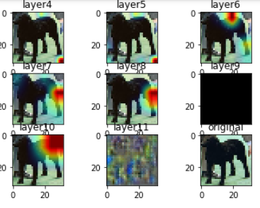

#### Epoch 9

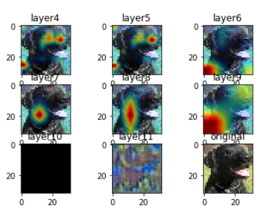

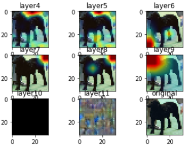

#### Epoch11

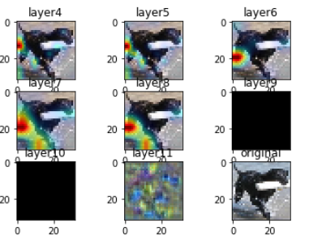

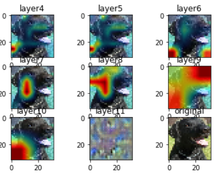

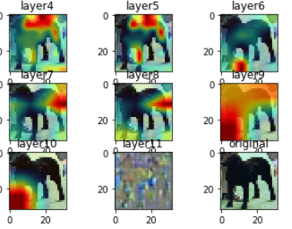

不知道能看出啥，整个过程中，神经网络的的关注位置总是变化

# Resolution 96

**同样的过拟合**

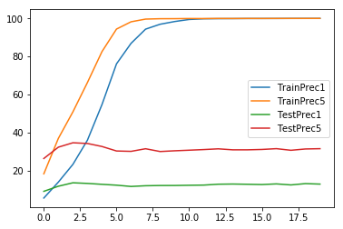

resolution 96 的图看着舒服多了

#### Epoch1

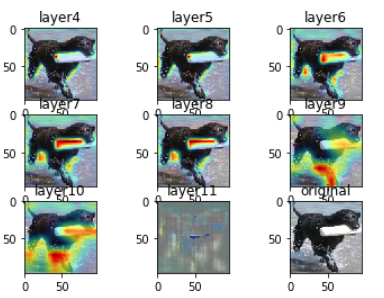

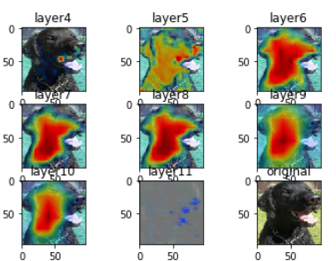

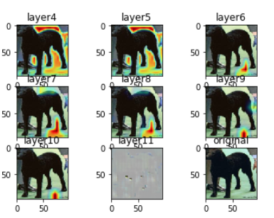

#### Epoch 3

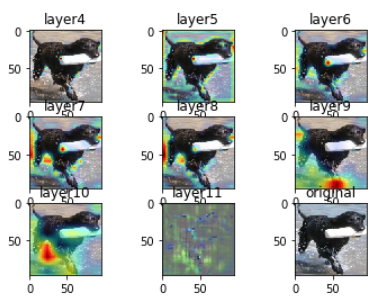

对浪花感兴趣

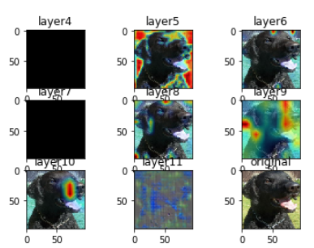

关注到狗鼻子

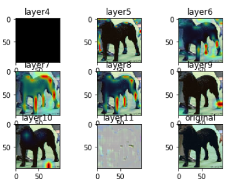

关注到了图片最下面的字

#### Epoch5

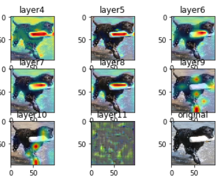

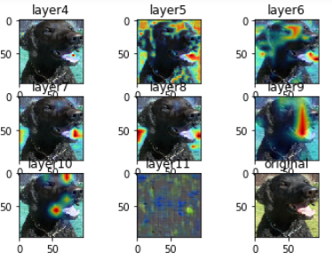

#### Epoch9

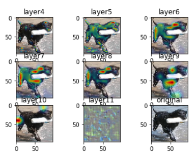

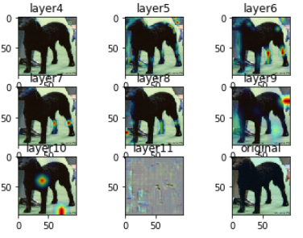

#### Epoch13

有些图片关注的位置还在变

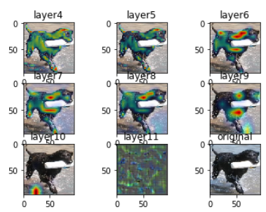

这张图片的关注点到了epoch15基本稳定在这里了

#### Epoch17

又变

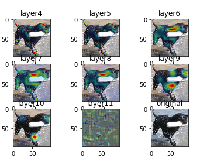