# Grad cam On VAE

现在已经把grad cam和相关的研究神经网络注意区域的算法移植到VAE上面了，我们可以叫它**area grad cam**, 也就是可以计算出生成图片的某一个区域，和原图的哪些区域有关，我的想法是：如果我们可以观察到：生成狗屁股的时候，神经网络也会注意到狗的身体，这说明可能这个神经网络比较好，它知道狗的毛色在全身基本都是一样的，所以在恢复屁股的特征的时候，只用记录那里有一个屁股即可，而不用记录详细的毛色等等的信息。

下图可以看出移植的效果还是有一些的：

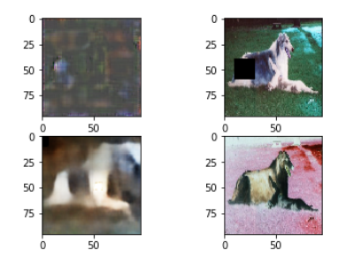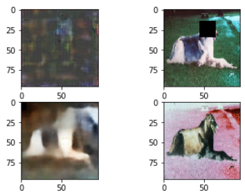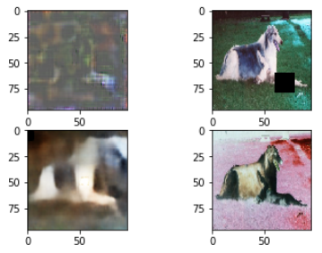

可以看到，当我们选取不同区域的时候，右上角图片的黑色位置，对应左上角图片的guided gradient的亮的部分也集中在相应的区域，**这一点可以说明我代码改写的基本合理**。

另外还能看出在背景十分混沌的区域（图四），得到的guided gradient十分不明显，同时那片区域的复原结果（左下角）是明显错误的，这是不是可以说明网络渐渐在学着关注主体？还能看出，几张图中，所有的黑框区域，都会对原图中一些特定的位置做成相应，（gradient map 中 黄黄绿绿的）这是为什么呢？神经网络连接不均匀嘛？

## grad-cam

其实上面的图片中用的不是grad-cam， 而是guided gradient， grad-cam的可视化效果比较混乱。grad-cam的计算和选取某一个卷积层有关，在做classification的任务时，一般选取最后一层卷积层，这一层的feature map的分辨率就决定了grad-cam的分辨率。 下面我选择了encoder中不同的层进行了调查（分别是main.4-main.11）(选择的区域是狗前腿的位置)

下面两个图左右分别应该：

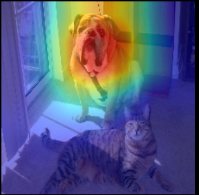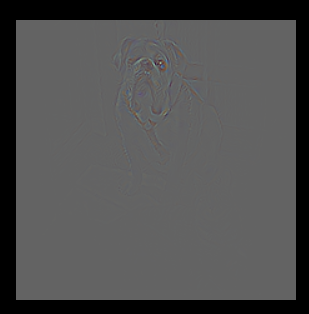

这种的，但是结果却这个屎样。。。。

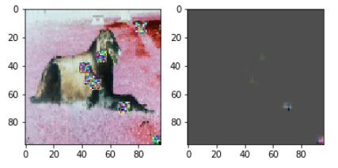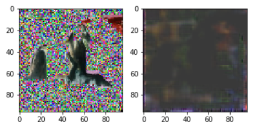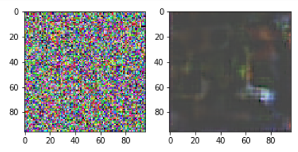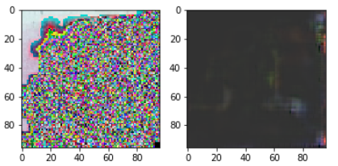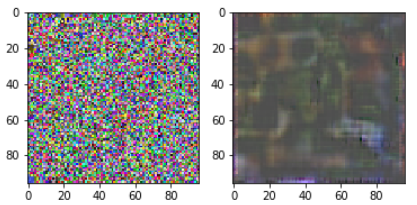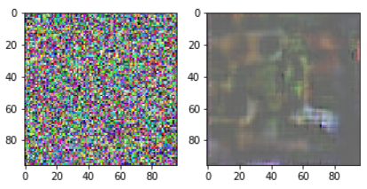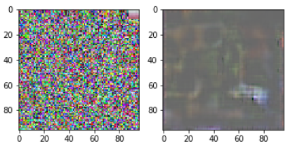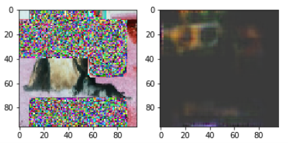

不知道为什么图片会变成反色的。。。怪瘆人的

grad-cam之所以不好的原因是grad-cam有一个假设，它假设我们选取的某一个卷积层是保留了很多的语义信息和空间信息，语义信息指的是分类时候的语义信息，比如这是个狗，假设中，不同的语义信息体现在不同的channel上，所以grad-cam选取了和目标分类最有关的channel。但是在VAE的任务中，可能语义信息这种东西十分不明显，所以grad-cam效果不好。

**前面是4层网络，128隐层，训练50轮，换成1024隐层训练100轮效果：**

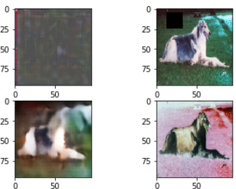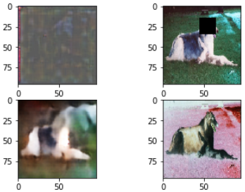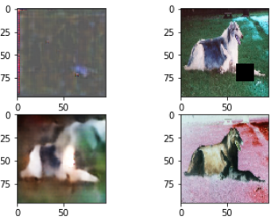

可以看出，关注的区域更加均匀了，之前看到的花花绿绿的斑点没有了（可能和训练轮数有关）。但是这也说明复原一个图片的时候，信息仍然是来自相应的区域，而不是全局什么的

另外，这个结构训练到96轮左右的时候，测试精度loss开始明显超过训练loss（之前还有不少次测试loss比训练loss略好）。

下面这个图也许可以说明，现在的VAE神经网络还是复原的简单特征，比如黑色区域那里的一道斜线，就被很好地复原了出来，甚至把狗头都弄没了。

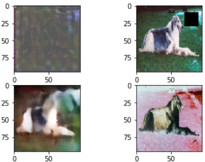

### LinearVAE 的guided gradient的，

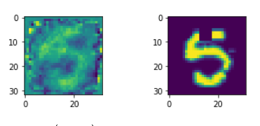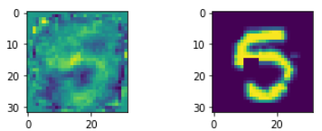

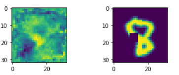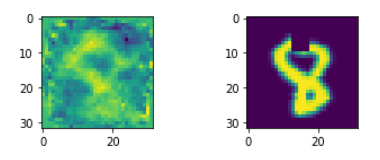

可以看出，除了对对应的区域外敏感之外，还对整个数字的轮廓敏感，这说明网络学到了一些东西